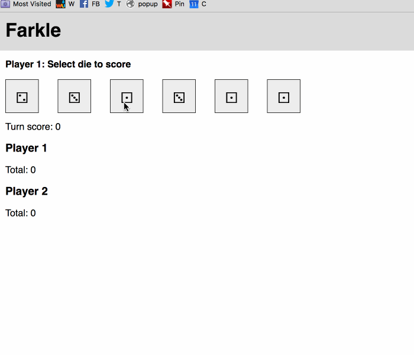

# React Farkle Game

Using as my tutorial for learning React. [Find out more about Farkle](https://en.wikipedia.org/wiki/Farkle).

Currently has:

* Some [React](https://facebook.github.io/react/) structure
* Some [Ava](https://github.com/avajs/ava) testing for scoring mechanisms
* Some styling, but not much :smirk:

## Install

1. Clone it.
1. `nvm use` (if you're using [nvm](https://github.com/creationix/nvm)).
2. `npm install` it.
3. `npm run webpack` it.
4. Serve it (requires [docker-compose](https://docs.docker.com/compose/)): `npm run up` (find the game at `localhost:8080`)
5. Stop serving it: `npm run down`

## Gif it

